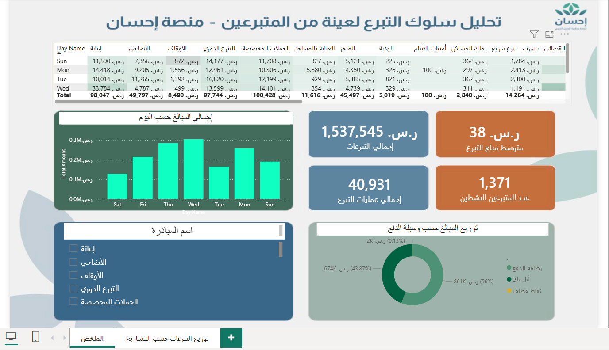
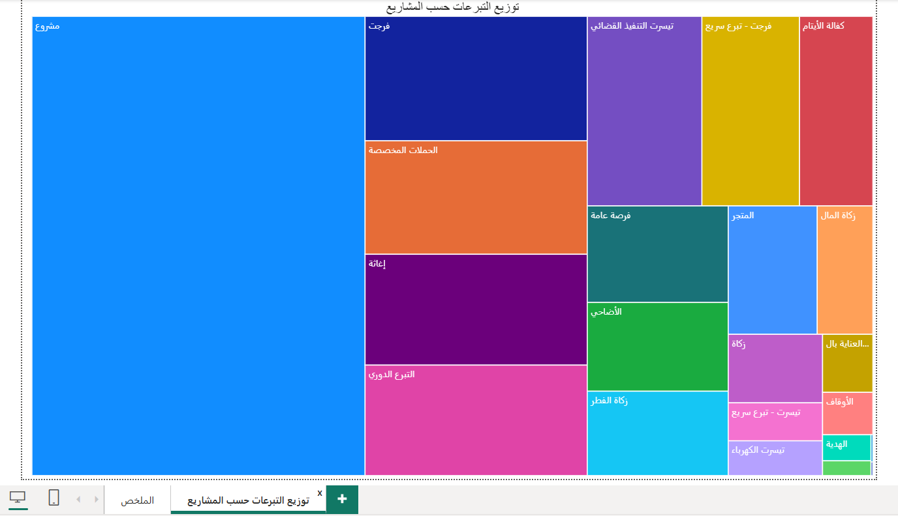

# 📊 تحليل سلوك التبرع لعينة من المتبرعين - منصة إحسان
### Ehsan Donor Behavior Analysis - Sample Study

> **تحويل البيانات الخام إلى رؤى تفاعلية لفهم نمط التبرع الرقمي في المملكة العربية السعودية.**

  
  

---

## 📝 نبذة عن المشروع | Project Overview
**بالعربية:** لوحة بيانات تفاعلية تم بناؤها باستخدام **Power BI** لتحليل عينة بيانات من منصة إحسان، بهدف استكشاف أنماط التبرع وتحويلها إلى رؤى (Insights) تدعم فهم سلوك المتبرع الرقمي في المملكة العربية السعودية.

**English:** An interactive dashboard built with **Power BI** to analyze a data sample from the Ehsan Platform. The project focuses on exploring donation patterns and converting raw data into actionable insights to understand digital donor behavior in Saudi Arabia.

---

## 🚀 المميزات التقنية | Technical Highlights

### 🇸🇦 القسم العربي
* **Data Cleaning:** تنظيف ومعالجة البيانات لضمان دقة الرسوم البيانية وتسهيل التحليل الزمني.
* **Custom Sorting:** بناء نموذج ترتيب مخصص لأيام الأسبوع لضمان عرض التدفق المالي بشكل منطقي (من الأحد إلى السبت).
* **UI/UX Design:** تصميم واجهة مستخدم بسيطة وعصرية تعكس الهوية البصرية للمنصة مع توفير فلاتر تفاعلية للوصول السريع للمعلومات.

### 🌐 English Section
* **Data Cleaning:** Data cleaning and processing to ensure visualization accuracy and facilitate time-series analysis.
* **Custom Sorting:** Implemented a custom sorting logic for weekdays to ensure a logical flow of financial trends (Sunday - Saturday).
* **Advanced Analytics:** Used DAX to calculate key metrics like average donation value and payment method distribution.

---

## 🛠️ الأدوات المستخدمة | Tools Used

| الأداة / Tool | الوظيفة / Function |
| :--- | :--- |
| **Power BI Desktop** | Visualizing & Dashboarding |
| **Power Query** | Data Transformation (ETL) |
| **DAX Measures** | Statistical & Complex Calculations |

---

## 🔗 المصادر | Sources
* **مصدر البيانات:** [منصة البيانات المفتوحة](https://open.data.gov.sa/ar/datasets/view/cc3b177a-5e5d-4845-bb92-6119b1322b05/resources)

---

---

   
  

  <h2>KHALID ALSHAMMARI</h2>
  
💡 2026 | Ehsan Platform Data Analysis Project (2021 - 2023 Sample)

